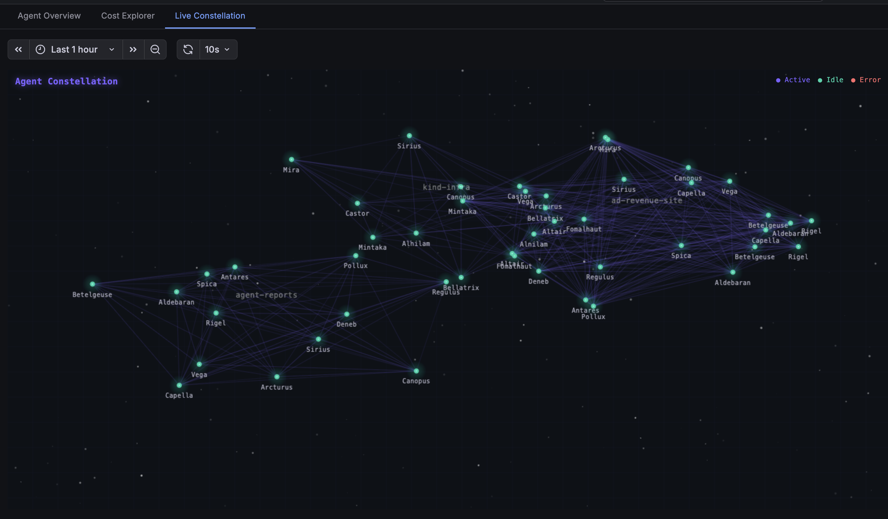
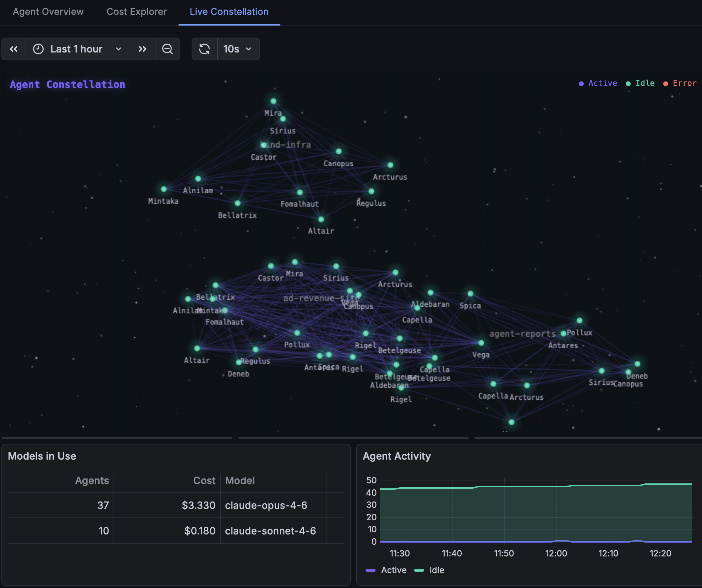
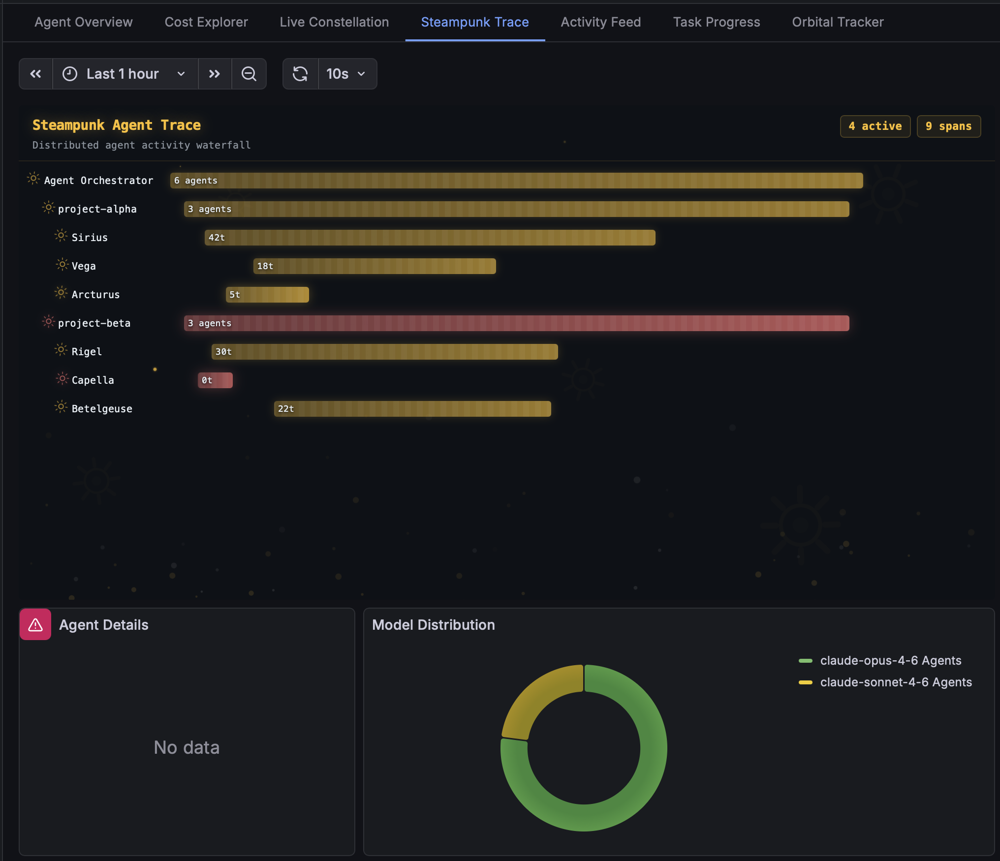

# Claude Agent Manager — Grafana Scenes App

A Grafana app plugin built with [@grafana/scenes](https://grafana.com/developers/scenes/) that provides real-time monitoring and visualization of autonomous Claude AI agents.



## Features

### Agent Overview
Stat panels, time series, and tables showing:
- Active / Idle / Total agents
- Cumulative cost and total turns
- Agent activity over time (active, idle, done, error)
- Model breakdown (Opus vs Sonnet usage, cost per model)
- Model cost distribution (donut chart)

### Cost Explorer
Cost tracking and model usage analysis:
- Per-model cost accumulation
- Cost over time series
- Project-level cost breakdown

### Live Constellation
Custom HTML5 canvas visualization showing agents as stars grouped by project:
- Each agent is a glowing node named after a real star (Sirius, Vega, Betelgeuse...)
- Agents cluster by project with connection lines
- Color-coded by status: cyan (active), green (idle), red (error)
- Background star field with shimmer effects
- Auto-refreshes every 10 seconds



### Steampunk Trace
Distributed agent activity waterfall with a steampunk aesthetic:
- Agents displayed as waterfall bars grouped by project
- Spinning cog icons, amber-tinted animated bar fills with scrolling stripes
- Steam particle effects and spark emissions
- Live agent count and turn metrics per span
- Model distribution donut chart



### Activity Feed
Retro CRT terminal showing live agent milestones:
- macOS-style window chrome with scanline overlay
- Color-coded log levels (info, warn, error, debug, success)
- Glitch effects and blinking cursor animation
- Auto-refreshes every 10 seconds

### Task Progress
Animated per-project task completion:
- Progress bars with counting-up number effects
- Neon glow shadows color-coded by completion percentage
- Shimmer effects and canvas particle emissions

### Orbital Tracker
Agents orbiting a central "Orchestrator" planet:
- Each project gets its own elliptical orbit ring
- Agents leave particle trails as they orbit
- Active agents orbit faster than idle ones
- Telemetry readout: active/idle/total/cost
- Shooting star easter eggs

## Architecture

```
grafana-scenes-app/
├── src/
│   ├── module.ts              # Plugin entry point (AppPlugin.setRootPage)
│   ├── plugin.json            # Plugin metadata and includes
│   ├── constants.ts           # Plugin ID, base URL, datasource config
│   ├── components/
│   │   ├── App.tsx                 # Root component with 7 tabbed EmbeddedScenes
│   │   ├── ConstellationPanel.tsx  # HTML5 canvas star constellation
│   │   ├── SteampunkTracePanel.tsx # Waterfall trace with cogs & particles
│   │   ├── ActivityFeedPanel.tsx   # Retro CRT terminal feed
│   │   ├── TaskProgressPanel.tsx   # Animated progress bars
│   │   ├── OrbitalTrackerPanel.tsx # Orbital agent animation
│   │   ├── AgentHeatmap.tsx        # Agent activity heatmap
│   │   └── StatusBoard.tsx         # Real-time status board
│   ├── scenes/
│   │   ├── agentScene.ts           # Agent Overview (stats, timeseries, tables)
│   │   ├── costScene.ts            # Cost Explorer
│   │   ├── constellationScene.ts   # Constellation wrapper
│   │   ├── steampunkTraceScene.ts  # Steampunk Trace wrapper
│   │   ├── activityFeedScene.ts    # Activity Feed wrapper
│   │   ├── taskProgressScene.ts    # Task Progress wrapper
│   │   ├── orbitalTrackerScene.ts  # Orbital Tracker wrapper
│   │   └── shared.ts              # Infinity datasource helpers
│   └── img/
│       └── logo.svg
├── webpack.config.js          # AMD output, Grafana externals
└── package.json
```

## Data Source

Uses the [Infinity data source](https://grafana.com/grafana/plugins/yesoreyeram-infinity-datasource/) plugin to query the Claude Manager API:

| Endpoint | Data |
|----------|------|
| `/api/agents` | All agents with status, model, project, star name |
| `/api/stats` | Global stats (active agents, costs, turns) |
| `/api/metrics/summary` | Aggregated metrics |
| `/api/metrics/agents` | Agent activity time series |
| `/api/metrics/models` | Model breakdown |
| `/api/metrics/health` | System health |
| `/api/projects` | Managed projects |
| `/api/projects/{name}/tasks` | Task list per project |

## Build

```bash
npm install
npm run build
```

Output goes to `dist/`. The build bundles `@grafana/scenes`, `@grafana/schema`, `@grafana/i18n`, and `@grafana/e2e-selectors` since Grafana does not expose them as runtime AMD modules.

### Externals (provided by Grafana at runtime)
- `react`, `react-dom`
- `@grafana/data`, `@grafana/ui`, `@grafana/runtime`
- `@emotion/css`, `@emotion/react`
- `rxjs`, `lodash`, `react-router`, `react-router-dom`

## Deploy to Kind Cluster

The plugin is deployed via ConfigMap to the `grafana` namespace on the `kind-scoady` cluster:

```bash
# Build
cd grafana-scenes-app && rm -rf dist && npm run build

# Deploy ConfigMap
kubectl config use-context kind-scoady
kubectl delete configmap grafana-scenes-plugin -n grafana
kubectl create configmap grafana-scenes-plugin \
  --from-file=module.js=dist/module.js \
  --from-file=plugin.json=dist/plugin.json \
  --from-file=logo.svg=dist/img/logo.svg \
  -n grafana

# Restart Grafana to pick up changes
kubectl rollout restart deployment/grafana -n grafana
kubectl rollout status deployment/grafana -n grafana --timeout=120s
```

Or use the deploy script:
```bash
cd ../grafana && bash deploy.sh
```

### Grafana Configuration

Key settings in `grafana/values.yaml`:
- `GF_PLUGINS_ALLOW_LOADING_UNSIGNED_PLUGINS: scoady-claudectl-app`
- `GF_PATHS_PLUGINS: /var/lib/grafana/plugins-rw` (writable emptyDir)
- Plugin provisioned via `provisioning/plugins/app.yaml`

## Access

```
URL:   http://grafana.localhost/a/scoady-claudectl-app
Login: admin / admin
```

## Part of claudectl

This plugin is part of the [claudectl](https://github.com/scoady/codexctl) ecosystem:
- **claudectl** — Go binary: API server + embedded web dashboard
- **c9s** — Terminal UI (bubbletea + lipgloss)
- **grafana-scenes-app** — This Grafana plugin
- **grafana/** — Helm values + JSON dashboards
